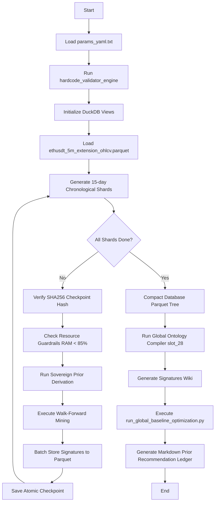

# KRONOS Full Corpus Mining & Prior Calibration Guide

This guide provides technical specifications and operational instructions for executing the production-grade **Full Corpus Mining** pipeline and subsequent **Global Prior Optimization** on the `KRONOS_HYBRID-V5` platform.

---

## 1. Pipeline Overview

The Full Corpus Mining pipeline executes high-throughput, walk-forward quantitative signature extraction over multi-year high-resolution datasets. To eliminate human epistemic bias, all mining is governed by **locked static priors** and is fully compliant with the **Zero Inline Literal Doctrine**.



---

## 2. Mandatory Hardenings & Safety Systems

### 15-Day Chronological Sharding
Mining is paged in chronological intervals of exactly **15 days** (configurable via `params_yaml.txt`). This mitigates the risk of catastrophic run failure due to memory spikes or extreme market volatility regimes.

### Cryptographic Checkpoint Resumability
To guarantee that checkpoints are fully untainted by code modifications, file corruption, or configuration drift, every shard checkpoint is stored with a unique SHA256 cryptographic signature:
$$\text{Shard Hash} = \text{SHA256}(\text{shard\_start} + \text{shard\_end} + \text{config\_hash} + \text{raw\_data\_sha256})$$
If a config parameter changes or a data file is mutated, the pipeline detects the mismatch and automatically re-mines affected shards to enforce strict mathematical reproducibility.

### Memory & System RAM Guardrails
Host memory is monitored dynamically. If virtual memory usage exceeds **85%**, the script automatically performs a safe database flush, saves the checkpoint registry, and exits cleanly to prevent Out-Of-Memory (OOM) operating system crashes.

---

## 3. Configuration

All runtime behaviors are defined within the `full_corpus_mining` block inside [params_yaml.txt](file:///f:/KRONOS_Madurai/params_yaml.txt):

```yaml
full_corpus_mining:
  chunk_size_days: 15            # Span of each chronological shard
  checkpoint_interval_shards: 3 # Save status logs every 3 shards
  max_memory_percent: 85.0       # Host RAM threshold limit
  checkpoint_file: "data/full_corpus_checkpoint.json"
```

---

## 4. Operational Playbook

### Running the Pre-flight Dry Run
Validate data-range boundaries, shard chunk resolution, and sovereignty compliance without performing heavy computing:
```bash
python run_full_corpus_mining.py params_yaml.txt --dry-run
```

### Starting the Mining Pipeline
To execute the live chronological sweep:
```bash
python run_full_corpus_mining.py params_yaml.txt
```

### Resuming an Interrupted Run
If the run is interrupted (due to memory warnings, power loss, or operator intervention), simply execute the command again. The pipeline will cryptographically verify completed shards against the registry and resume exactly where it left off:
```bash
python run_full_corpus_mining.py params_yaml.txt
```

---

## 5. Post-Mining: Global Prior Calibration

Once the complete corpus has been mined, run the dedicated statistical calibration optimizer to calculate global aggregates and optimize static priors:

```bash
python run_global_baseline_optimization.py params_yaml.txt
```

### Outputs Generated:
1. **Compacted Signatures Matrix**: Located at `data/signatures_compact.parquet`.
2. **Stable Phylum Clustering**: Mapped to `slot_28` in the database.
3. **DuckDB Analytical Views**: Bound over the compacted file for sub-millisecond querying.
4. **Interactive Signatures Wiki**: Formatted automatically at `output/signatures/` (or database root).
5. **Markdown Prior Recommendation Ledger**: Saved at `data/audit/global_baseline_recommendations.md`. Use the suggested weights and bounds inside this file to update `params_yaml.txt` for your next quantitative cycle.
